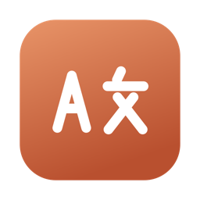

# Translate

A native macOS app that translates text with **Claude Sonnet 5** or **GPT-5.6
Luna**, plus a configurable global shortcut that translates the current
selection into a floating card — without leaving the app you're in, even a
full-screen one.



Written in Swift and SwiftUI against AppKit. No web view, no bundled runtime:
the whole app is a 2 MB universal binary.

## What it does

- **Main window** — paste text, pick languages, get a streamed translation. The
  window has no title bar of its own: the language controls sit in that row, and
  both texts share one recessed well below them.
  ⌘↩ translates, ⌘. stops. The language pickers are searchable: click one and
  type any part of the English name, the endonym, or the code (`pt-` narrows to
  the two Portuguese variants, `简` finds Simplified Chinese).
- **Auto-detect** — the source language defaults to *Detect language*; the
  detected language comes back as a capsule next to the result.
- **Formal / informal register** — the choice is enforced in the prompt with
  language-specific guidance, so Polish gets *Pan/Pani* vs *ty*, German *Sie* vs
  *du*, Japanese です/ます vs plain forms, and so on. The control is only live for
  target languages that actually mark the distinction; English, Hebrew, Arabic,
  and the mainland Scandinavian languages pin it to *Auto*.
- **Speaker and addressee gender** — two *Auto / Male / Female* controls behind
  a **Gender** button in the control bar, folded away by default because most
  translations need neither. Many languages inflect for the gender of the person
  being addressed *and* for the gender of whoever is speaking, and English gives
  the model nothing to go on: Polish *czy mógłby Pan* vs *czy mogłaby Pani* for
  the addressee, *zrobiłem* vs *zrobiłam* for the speaker, Russian and Czech past
  tenses, Hebrew and Arabic first- and second-person verbs, Romance and Greek
  adjectives, ครับ vs ค่ะ in Thai. Each control is gated on its own question —
  21 of the 38 languages mark the addressee, 22 the speaker (Thai marks who is
  speaking but not who is spoken to) — and pins to *Auto* where the language
  does not mark it. On *Auto* the model takes the gender from the text where the
  text makes it clear, and otherwise picks phrasing that avoids the marking
  rather than writing *gotowy/gotowa*. A dot on the collapsed button shows when
  either choice is in force, so a setting made once is never invisible.
- **Global shortcut** (default <kbd>⌘⇧T</kbd>) — copies the selection out of
  whatever app is frontmost, translates it, and shows the result in a floating
  card next to the pointer. The card is a non-activating `NSPanel` that joins
  every Space, so triggering it from a full-screen app does not switch you out
  of it. ⎋ dismisses it, ⌘C copies the translation. Its header reads
  `source → target`; clicking the target opens the same searchable list and
  re-translates the captured text into whatever you pick.
- **Two providers** — Claude Sonnet 5 (adaptive thinking) or GPT-5.6 Luna,
  chosen in Settings › General. Both get byte-identical instructions and the
  same four Quality levels, so switching provider changes who translates and
  nothing else about what was asked for. Each keeps its own key, so switching
  back and forth costs nothing.
- **Menu-bar resident** — closing the main window leaves the shortcut working;
  quit from the menu-bar menu.

## Installing

Download `Translate.dmg` from the
[latest release](https://github.com/lenbrocki/translate/releases/latest), open
it, and drag the app to Applications. Releases are signed with a Developer ID
certificate and notarized by Apple, so they open without any right-click
warning dance.

## Requirements

- macOS 14 or newer (Apple silicon or Intel)
- An API key for whichever provider you translate with — Anthropic, OpenAI, or both
- **Accessibility permission**, for the shortcut only. macOS gives no way to
  read another app's selection directly, so the app synthesises a ⌘C, reads the
  pasteboard, and puts the previous contents back — the same approach DeepL
  uses. Grant it under *System Settings › Privacy & Security › Accessibility*;
  Settings › Shortcut has a button that opens the prompt.

  One consequence worth knowing: restoring the clipboard restores the **plain
  text** that was on it. If you had an image or rich text copied when you fired
  the shortcut, that flavour is lost.

## Setting the API key

Paste it into **Settings › API Keys**, under the provider it belongs to. It goes into your login **keychain**
(service `com.lennartbrocki.translate`), not a file on disk, and that is the
only place the app reads them from — one item per provider, so switching costs
nothing. There is deliberately no `ANTHROPIC_API_KEY` or `OPENAI_API_KEY`
fallback: whether an inherited environment variable applied would depend on how
the app happened to be launched, which you cannot see from inside it.
Everything else is in `UserDefaults`.

## Building

```bash
cd native && ./build.sh
```

That compiles a universal (arm64 + x86_64) release binary, assembles
`Translate.app`, signs it ad hoc, and writes `native/dist/Translate.dmg`.
`./build.sh --native` skips the second architecture and is roughly twice as
fast.

For a quick edit-run loop, `swift build && .build/debug/Translate` works, but
the menu-bar item and window activation only behave correctly from inside the
app bundle — so prefer `./build.sh --native && open dist/Translate.app`.

### A note on signing

A local `./build.sh` signs ad hoc, so macOS quarantines the app on first
launch: right-click it in `/Applications` and choose *Open*, or run
`xattr -dr com.apple.quarantine "/Applications/Translate.app"`. Downloads from
the Releases page are signed and notarized properly and need none of that.

An ad-hoc signature also changes on every rebuild, which means macOS treats
each build as a new app: the Accessibility grant has to be re-approved after
you replace the app, and the keychain will ask once for permission to read a
key a previous build saved. Saving the key again in Settings clears that for
good, because writing deletes and re-adds the item, leaving the running build
as its owner. A real Developer ID signature avoids both, and is what the
release workflow uses:

```bash
cd native
VERSION=1.0.0 CODESIGN_IDENTITY="Developer ID Application: …" ./build.sh
```

## Releasing

Push a tag and [`.github/workflows/release.yml`](.github/workflows/release.yml)
does the rest — Developer ID signing with the hardened runtime, notarization
and stapling of both the app and the disk image, then a GitHub Release with the
`.dmg` attached:

```bash
git tag v1.0.0 && git push origin v1.0.0
```

The workflow calls the same `native/build.sh` you run locally, passing
`CODESIGN_IDENTITY` and `VERSION`; the only reason it invokes it twice
(`--app-only`, then `--dmg-only`) is that notarization has to happen between
the two halves, so the disk image is built around an already-stapled app.

It needs six repository secrets:

| Secret | What it is |
| --- | --- |
| `MACOS_CERTIFICATE` | Developer ID Application certificate + private key, exported as `.p12` and base64-encoded |
| `MACOS_CERTIFICATE_PWD` | The password set when exporting that `.p12` |
| `KEYCHAIN_PASSWORD` | Any string; the throwaway keychain the runner creates uses it |
| `APPLE_ID` | The Apple ID the certificate belongs to |
| `APPLE_TEAM_ID` | Your 10-character team identifier |
| `APPLE_APP_PASSWORD` | An app-specific password from appleid.apple.com, for `notarytool` |

## How it's put together

| Path | What lives there |
|---|---|
| `native/Sources/Translate/Service/Translation.swift` | The request, the shared prompt, SSE and header parsing, provider dispatch |
| `native/Sources/Translate/Service/AnthropicClient.swift` | Streaming Messages API client |
| `native/Sources/Translate/Service/OpenAIClient.swift` | Streaming Responses API client |
| `native/Sources/Translate/Service/SelectionCapture.swift` | Reading the frontmost app's selection, pasteboard save/restore |
| `native/Sources/Translate/Service/GlobalHotKey.swift` | The system-wide shortcut, via Carbon's `RegisterEventHotKey` |
| `native/Sources/Translate/UI/OverlayController.swift` | The non-activating `NSPanel`, its placement and dismissal |
| `native/Sources/Translate/UI/MainView.swift` | Main window |
| `native/Sources/Translate/UI/LanguageField.swift` | The searchable language pop-up |
| `native/Sources/Translate/UI/PlainTextEditor.swift` | The text view, with insets and placeholder we control exactly |
| `native/Sources/Translate/UI/SettingsView.swift` | Settings (⌘,) |
| `native/Sources/Translate/Model/` | Languages, preferences, keychain, per-window translation state |
| `native/build.sh` | `.app` + `.dmg` assembly |

The Anthropic path posts to `/v1/messages` as `claude-sonnet-5` with
`thinking: {"type": "adaptive"}`; the OpenAI path posts to `/v1/responses` as
`gpt-5.6-luna` with `store: false`. The **Quality** setting is the same dial on
both — `output_config.effort` and `reasoning.effort` — and `low`, `medium`,
`high` and `xhigh` are valid values for each, so the setting means the same
thing whichever provider is selected. It defaults to `medium`; raise it when a
passage needs care, lower it when you want speed. (GPT-5.6 also accepts `none`,
`minimal` and `max`, which the app does not expose because Claude has no
equivalent.)

Translations stream token by token over `URLSession.bytes`. On the Anthropic
side the system prompt is cached, so repeated translations into the same
language with the same register only pay for the new text.

The text you send is treated strictly as material to translate — the prompt
tells the model to translate any questions or instructions it contains rather
than acting on them.

### Threading

Every AppKit call that orders or configures a window is on `@MainActor`:
`OverlayController` is main-actor-isolated as a whole, and the hot-key callback
hops to the main queue before it touches anything. Selection capture is the one
piece that must not run there — it blocks for up to ~700 ms waiting for the
frontmost app to service the copy — so it runs on its own dispatch queue and is
awaited.
