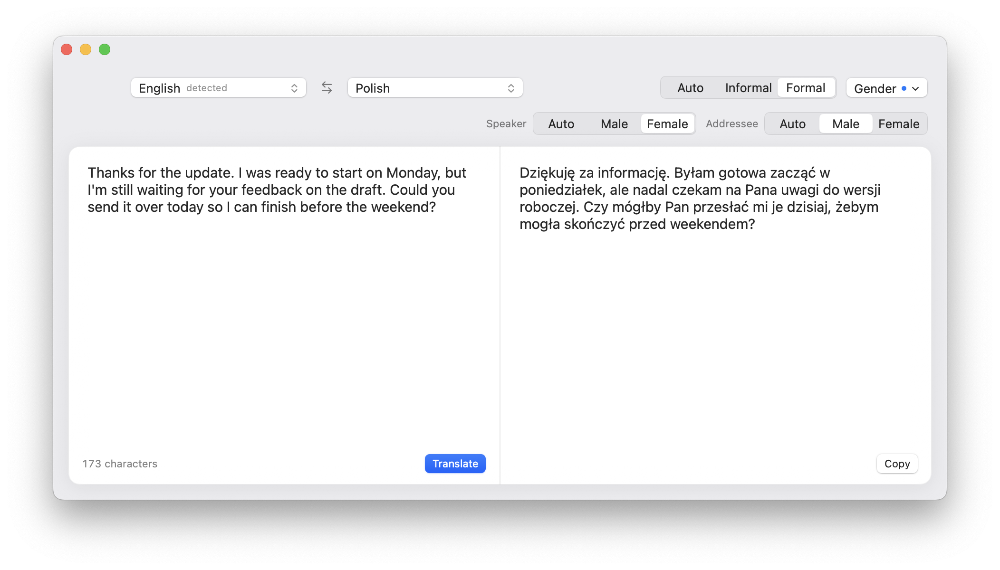
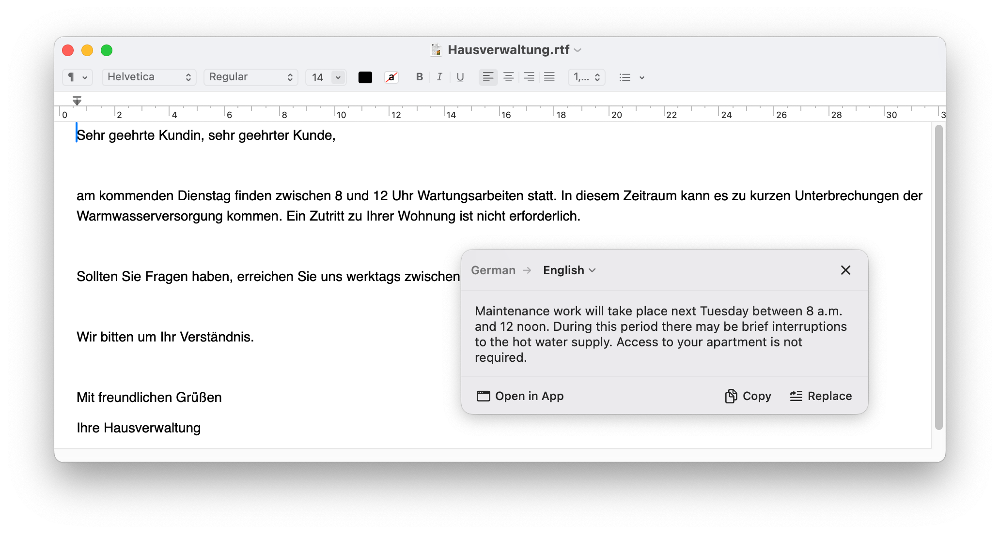

# Translate

A macOS app that translates text with **Claude Sonnet 5** or **GPT-5.6 Luna** —
in its own window, or right inside whatever app you're using, with a keyboard
shortcut that shows the translation in a floating card next to your pointer.

## Register and gender, not just language

English often leaves out things other languages have to say. The app lets you
fill them in. **Formal** picks *Pan/Pani* over *ty*. **Speaker: Female** gets
*Byłam gotowa* and *żebym mogła* rather than *Byłem gotowy*. **Addressee: Male**
gets *czy mógłby Pan* rather than *czy mogłaby Pani*. Each control only works
for target languages that make that distinction. The gender row stays folded
away until you need it, and a dot on the **Gender** button tells you when a
choice is active.

## Translate in whatever app you're already in

Select text anywhere, press <kbd>⌘⇧T</kbd>, and the translation appears in a
card next to the pointer. The app you're in keeps focus, and a full-screen app
stays full-screen. From the card you can copy the translation, paste it over
the text you selected, or open it in the main window to keep working on it.

## Getting started

1. **Install.** Download `Translate.dmg` from the
   [latest release](https://github.com/lenbrocki/translate/releases/latest),
   open it, and drag **Translate** to your Applications folder. Requires macOS
   14 or newer, on Apple silicon or Intel.
2. **Add an API key.** Open **Settings › API Keys** (<kbd>⌘,</kbd>, or
   *Settings…* in the menu-bar menu). Paste your key under the provider it
   belongs to and click **Save**. You need a key for at least one of them:
   - Anthropic (Claude) — create one at
     [console.anthropic.com](https://console.anthropic.com/settings/keys)
   - OpenAI — create one at
     [platform.openai.com](https://platform.openai.com/api-keys)

   You can add both and switch between them in **Settings › General**. Each
   provider keeps its own key, so switching doesn't lose anything.
3. **Allow Accessibility** (only needed for the shortcut). Go to
   **Settings › Shortcut** and click **Grant…**, or turn on Translate under
   *System Settings › Privacy & Security › Accessibility*. macOS requires this
   before an app can read text you've selected in other apps.

### About your API key

Your key is stored in your macOS **login keychain**, not in a file, and
requests go straight from your Mac to Anthropic or OpenAI. The app reads keys
only from the keychain. It ignores any `ANTHROPIC_API_KEY` or `OPENAI_API_KEY`
set in your shell. To remove a key, use **Remove saved key** in
**Settings › API Keys**. Translations are billed to your own account with that
provider.

## Using the main window

- **Type or paste** on the left. A paste translates right away. Typing
  translates once you pause for a moment, or press <kbd>⌘↩</kbd>.
  <kbd>⌘.</kbd> stops a translation in progress.
- **Pick languages** from the two pickers at the top. They're searchable: click
  one and type part of the English name, the language's own name, or its code.
  For example, `pt-` shows both Portuguese variants and `简` finds Simplified
  Chinese.
- **Detect language** is the default source. Once a translation comes back,
  the picker shows which language was detected. The ⇆ button swaps the source
  and target and translates the result back.
- **Register** (*Auto / Informal / Formal*) sets how formally to address the
  reader: *Sie* or *du* in German, *vous* or *tu* in French, polite or plain
  forms in Japanese. It's greyed out for languages without that distinction,
  like English.
- **Gender** opens two more controls:
  - **Speaker** — the gender of the "I" in the text. It changes Polish
    *zrobiłem/zrobiłam*, Spanish *listo/lista*, and Hebrew and Arabic verb
    forms.
  - **Addressee** — the gender of the person you're writing to, as in Polish
    *Pan/Pani*.

  On *Auto*, the translation uses whatever the text makes clear and otherwise
  picks wording that avoids guessing. Changing register or gender translates
  the text again straight away.
- **Copy** puts the translation on the clipboard. When the text came from the
  card via **Open in App**, you also get **Replace in *app***, which pastes
  the translation back over your original selection.

## Using the shortcut

1. Select text in any app — a browser, Mail, a PDF, a chat window.
2. Press <kbd>⌘⇧T</kbd>. You can change the shortcut in **Settings › Shortcut**.
3. The translation appears in a card next to the pointer.

In the card:

| Action | How |
| --- | --- |
| Copy the translation | <kbd>⌘C</kbd> or **Copy** |
| Replace the selected text with the translation | <kbd>⌘↩</kbd> or **Replace** |
| Translate into a different language | Click the target language in the card's header |
| Continue in the main window | **Open in App** |
| Close the card | <kbd>⎋</kbd>, the ✕ button, or click anywhere else |

The shortcut copies your selection to read it, then puts back what was on your
clipboard before. Only plain text is restored, so an image or formatted text
you had copied will be lost.

## Settings

- **General**
  - **Translate with** — Claude Sonnet 5 or GPT-5.6 Luna.
  - **Quality** — *Low*, *Medium*, *High* or *Very high*. Higher settings take
    more care over the wording, but they're slower and cost more. *Medium* is
    the default.
  - Default **Register**, **Speaker** and **Addressee**.
  - **Copy the translation when it finishes** — puts every finished
    translation on the clipboard automatically.
- **Shortcut** — change the key combination, or reset it to <kbd>⌘⇧T</kbd>.
  Also shows whether Accessibility is granted.
- **API Keys** — add, check or remove a key for each provider.

## Menu bar

Translate lives in the menu bar. When you close the main window, its Dock icon
goes away, but the shortcut keeps working. Use the menu-bar icon to reopen the
window (**Open Translate**), translate a selection, open **Settings…**, or
**Quit Translate**.

## License

[MIT](LICENSE)
